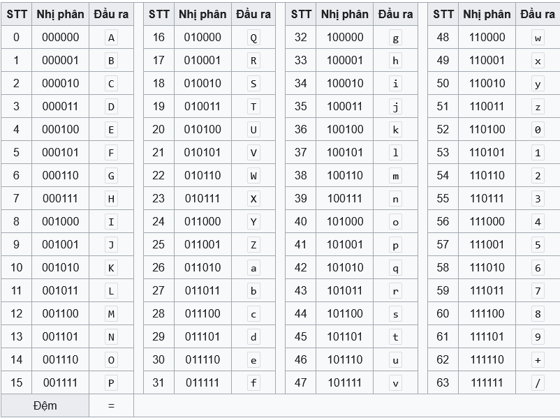

# Base64

- Base64 là 1 phương pháp mã hóa dữ liệu thành dạng văn bản ASCII, convert dạng mã hóa 2 chiều từ binary sang string để có thể truyền dữ liệu nhị phan trong network (như hình ảnh, mail) qua các giao thức chỉ hỗ trợ văn bản.

- bảng mã Base64 gồm có 64 ký tự: A-Z, a-z, 0-9, +, /

## Cách hoạt động 

- Trong quá tình thực hiện sẽ theo 4 bước chính:
    - Dữ liệu theo dnagj nhị phân của thông tin được mã hóa sẽ sắp xếp theo từng khối 3 byte (24 bit) 
    - Sau đó mỗi đoạn 24 bit sẽ được chia thành 4 phần 6 bit
    - Mỗi nhóm 6 bit sẽ được chuyển đổi thành cách ký tự Base64 tương ứng. Vậy mã hóa base64 sẽ chuyển đổi mỗi 3 ký tự thành 4 ký tự theo bảng base 64
    - Nếu dữ liệu không đủ làm bội số cho 3 byte (dư ký tự sau khi nhóm 3 ký tự một) thì sẽ được thêm ký tự "=" để padding cho đủ 

### Bảng base64:

## Ví dụ

- cho 1 chuỗi "vnQuyen"

- dạng nhị phân của chuỗi:
'''
v = 01110110
n = 01101110
Q = 01010001
u = 01110101
y = 01111001
e = 01100101
n = 01101110
Tổng: | 01110110 01101110 01010001 | 01110101 01111001 01100101 | 01101110 |
'''
- chia 6 bit 1 ta có 
'''| 011101 100110 111001 010001 | 011101 010111 100101 100101 | 0110111 10 |'''
nhưng vì vị trí cuối cùng dư ra 2bit để thành nhóm 6bit, lúc này khối bit đó sẽ được padding thêm các bit 0 để có giá trị và đủ 6 bit
''' | 011101 100110 111001 010001 | 011101 010111 100101 100101 | 011011 100000 | '''

- Theo bảng Base64:
'''
| 29  38  57  17 | 29  23  37  37 | 27 32 = = |
   d   m   5   R    d   X   l   l    b  g = =
'''
'=' dược padding thêm để tương ứng với mỗi 6 bit thiếu trong nhóm 24 bit

- Result: vnQuyen -base64-> dm5RdXllbg==

## Các biến thể của Base64

- Standard Base64:
    - bảng mã A-Z, a-z, 0-9, +, /
    - padding: có thể dùng =
    - ứng dụng trong: Email(MINE), HTTPS, các công cụ chung

- Base64 URL-safe:
    - bảng mã thay đổi " +, / --> -, _" vì tránh các ký tự không an toàn trong URL hoặc tên file
    - padding: dựa vào tùy ứng dụng có thể bỏ dấu "=" hoặc không
    - Ứng dụng: JSON web token

- Base64 MINE
    - là standard Base 64 nhưng: 
        - chia dòng mỗi 76 ký tự bằng "\r\n"
        - bẳng mã có thể khác 1 chút

- Base64 Crypt/Radix-64
    - biến thể này dùng trong mã hóa mật khẩu Unix/Linux

- Base64 XML-safe
    - 1 số hệ thống XML không chấp nhận ký tự +, / nên có thể thay bằng các ký tự khác tùy chỉnh 
